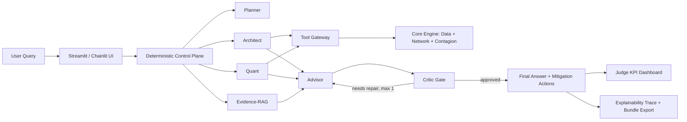
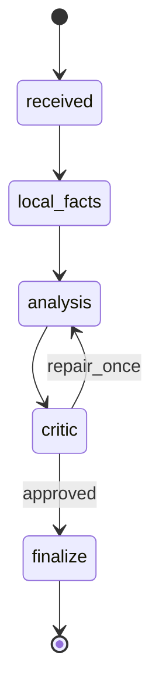

# RiskSentinel Architecture Diagram

This diagram is aligned with the current control-plane implementation and judge-facing explainability flow.

## System View

## Control-Plane State Machine

## Guardrails

- Hard route policy (`local_fast_mode`, `gpt`, fallback paths)
- Tool gateway with timeout/retry/schema checks
- Immutable evidence ledger for deterministic references
- Critic hard gate with bounded repair loop
